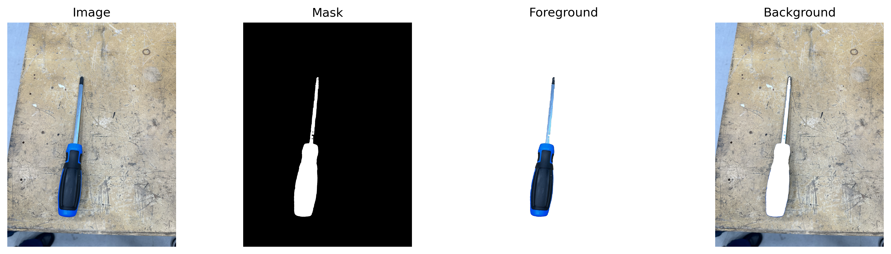

# Prosjekt 1 – Segmentering av verktøy med DinoV3 + logistisk regresjon

Dette prosjektet ble gjort i forbindelse med samlingsuke **Anvendt maskinlæring**. Målet var å bygge en komplett pipeline for segmentering av verktøy i bilder – fra rådata til en enkel modell som kan gjenkjenne og maskere nye verktøy.

---

## Mål
- Samle egne bilder av verktøy (hammer, skrutrekker osv.)
- Lage binære masker (hvit = verktøy, svart = bakgrunn)
- Ekstrahere features med DinoV3
- Trene en enkel logistisk regresjon
- Teste modellen på nye bilder og visualisere resultatene

## Kort sammendrag av hva vi har gjort.

Vi tok egne bilder av verktøy og gjorde dem brukbare ved å konvertere iPhone-HEIC til ekte PNG med et lite script (laget med hjelp fra AI).

Vi testet flere maskeringsverktøy, men endte med å lage vårt eget:  **`tools/click_n_mask_images.py`** (Tkinter + OpenCV + SAM) ved hjelp av AI. Du klikker på bildet (positiv/negativ), så spytter det ut binære masker og overlegg.
[Last ned SAM ViT-H (4b8939)](https://dl.fbaipublicfiles.com/segment_anything/sam_vit_h_4b8939.pth)

Maskene ble brukt til å trene en enkel modell: DINOv3 for å hente bilde-trekk, og logistisk regresjon for å avgjøre piksel = verktøy eller bakgrunn.

Alt kjøres fra **`main.ipynb`** etter at data er på plass. **`requirements.txt`** dekker pakkene, SAM-vekter trengs til klikke-verktøyet.

## Maskeringsverktøy vi brukte
**`tools/click_n_mask_images.py`** (interaktivt GUI med Tkinter + OpenCV + SAM):

- Venstreklikk = positivt punkt (verktøy)
- Høyreklikk = negativt punkt (bakgrunn)
- `Ctrl+Z` = angre siste punkt
- `r` = reset
- `s` = lagre binær maske (PNG, 0/255)
- `o` = lagre overlegg (maske oppå original)
- Piltaster = forrige/neste bilde

## Illustrasjon / eksempler

### 1) Datasett og maskeformat

### 2) Modellresultater: Ground Truth vs Predicted

### 3) Classifier score (eksempler)

### 4) Evalueringsmetrikker

### 5) Scorekart og etterbehandling (foreground score + median filter)

